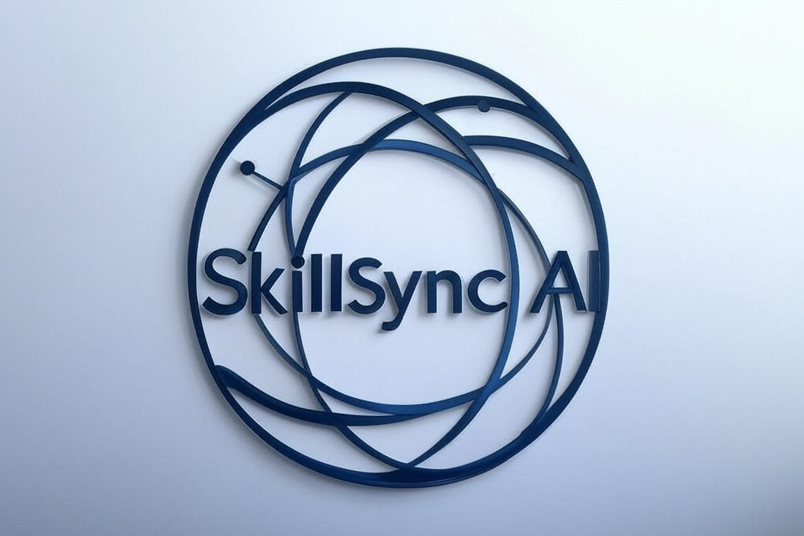

# SkillSync AI: Your AI-Powered Career Navigator

A comprehensive platform that analyzes resumes, provides personalized career guidance, and helps bridge skill gaps through intelligent AI-driven recommendations.

## Table of Contents
- [Features](#features)
- [Installation](#installation)
- [Usage](#usage)
- [Architecture](#architecture)
- [API Documentation](#api-documentation)
- [Contributing](#contributing)


# Installation

## Prerequisites
- Python 3.8 or higher
- Git
- pip (Python package manager)

## Step 1: Clone the Repository
```bash
git clone https://github.com/sohamfcb/multi-agent-upskilling.git
cd multi-agent-upskilling
```

## Step 2: Create and Activate Virtual Environment
```bash
# Windows
python -m venv proj-env
.\proj-env\Scripts\activate

# Linux/Mac
python3 -m venv proj-env
source proj-env/bin/activate
```

## Step 3: Install Dependencies
```bash
pip install -r requirements.txt
```

## Step 4: Set Up API Keys
Create a `.env` file in the project root directory with the following:
```
GEMINI_API_KEY=your_gemini_api_key
YOUTUBE_API_KEY=your_youtube_api_key
GROQ_API_KEY=your_groq_api_key
OPENAI_API_KEY=your_openai_api_key
TAVILY_API_KEY=your_tavily_api_key
```

Get API keys from:
- Gemini API: https://makersuite.google.com/app/apikey
- YouTube API: https://console.cloud.google.com/apis/credentials
- Groq API: https://console.groq.com/
- OpenAI API: https://platform.openai.com/api-keys
- Tavily API: https://tavily.com/

## Step 5: Install Additional Dependencies
```bash
# Install spaCy model
python -m spacy download en_core_web_sm

# Install sentence-transformers
pip install sentence-transformers
```

## Step 6: Create Required Directories
```bash
mkdir uploads
mkdir cached_faiss_store
```

## Step 7: Run the Application
```bash
# Windows
python app.py

# Linux/Mac
python3 app.py
```

The application will be available at `http://localhost:5000`

## Troubleshooting
1. If you encounter API key errors:
   - Verify all API keys are correctly set in `.env`
   - Check if the keys are active and have proper permissions

2. If you encounter dependency errors:
   - Make sure you're in the virtual environment
   - Try reinstalling dependencies: `pip install -r requirements.txt --force-reinstall`

3. If you encounter file permission errors:
   - Ensure the `uploads` directory has write permissions
   - Check if the application has access to create the `cached_faiss_store` directory

## Features
- **Resume Analysis**
  - Multi-format support (PDF, DOC, DOCX, Images)
  - Text extraction and parsing
  - Career summary generation
  - Skill gap analysis

- **ATS Scoring**
  - Job description matching
  - Keyword analysis
  - Skill matching
  - Score calculation

- **Career Guidance**
  - Personalized learning recommendations
  - Industry trend analysis
  - Skill gap identification
  - Course and resource suggestions

- **Interactive Chat**
  - Resume-based Q&A
  - Career advice
  - Real-time suggestions
  - Context-aware responses

## Usage
1. **Upload Resume**
   - Navigate to the explore page
   - Upload your resume in supported formats
   - Wait for text extraction and analysis

2. **View Analysis**
   - Review extracted text
   - Check career summary
   - View skill gaps
   - Get personalized recommendations

3. **ATS Scoring**
   - Enter job description
   - Get matching score
   - View matched skills and keywords
   - Identify areas for improvement

4. **Chat Interface**
   - Ask questions about your resume
   - Get career advice
   - Request learning resources
   - Discuss skill development

## Architecture
- **Frontend**
  - HTML/CSS/JavaScript
  - Server-Sent Events for real-time updates
  - Responsive design

- **Backend**
  - Flask web framework
  - LangGraph for agent management
  - FAISS for vector storage
  - Multiple AI models integration

- **AI Models**
  - Gemini 2.0 Flash
  - Groq (Qwen)
  - Sentence Transformers
  - spaCy for NLP

## API Documentation

### Resume Analysis Endpoints
```python
POST /handle_upload
# Upload and process resume
# Returns: Redirect to results page

GET /stream_suggestions
# Stream career suggestions
# Returns: SSE response with suggestions

POST /calculate_ats_score
# Calculate ATS score
# Returns: JSON with score and analysis

POST /chat
# Interactive chat endpoint
# Returns: JSON with AI response
```

### Key Functions
```python
def get_suggestions(text, agent, api_keys)
# Generate career suggestions based on resume

def score_resume(resume_path, job_description)
# Calculate ATS score for resume

def get_resume_details(text, model="gemini")
# Extract and analyze resume details
```

## Contributing
1. Fork the repository
2. Create a feature branch
3. Commit your changes
4. Push to the branch
5. Create a Pull Request

### Development Setup
```bash
# Install development dependencies
pip install -r requirements-dev.txt

# Run tests
pytest

# Check code style
flake8
```

### Project Structure
```
skillsync-ai/
├── app.py              # Main Flask application
├── agents.py           # AI agent definitions
├── helper.py           # Helper functions
├── helper_functions.py # Additional utilities
├── ats_score.py        # ATS scoring logic
├── langgraph_agent.py  # LangGraph implementation
├── memory.py           # Memory management
├── templates/          # HTML templates
├── uploads/           # Uploaded files
└── cached_faiss_store/ # Vector store cache
```

### Environment Variables
```env
GEMINI_API_KEY=your_gemini_api_key
YOUTUBE_API_KEY=your_youtube_api_key
GROQ_API_KEY=your_groq_api_key
OPENAI_API_KEY=your_openai_api_key
TAVILY_API_KEY=your_tavily_api_key
```

### Dependencies
- Flask
- LangGraph
- FAISS
- PyPDF2
- python-docx
- spaCy
- Sentence Transformers
- Google Generative AI
- Groq
- OpenAI

# Acknowledgments
- Google's Gemini AI for powering our core analysis
- LangGraph team for the agent framework
- FAISS for efficient vector storage
- The open-source community for their invaluable tools and libraries

# Contact
- **Project Maintainer**: Soham Mukherjee
- **Email**: soumyapu31@gmail.com
- **Website**: https://sohamfcb.github.io

---

*SkillSync AI is designed to help job seekers and professionals navigate their career paths with AI-powered insights. We're committed to making career development more accessible and data-driven.*

*Thank you for choosing SkillSync AI. Together, let's build better careers through technology.*